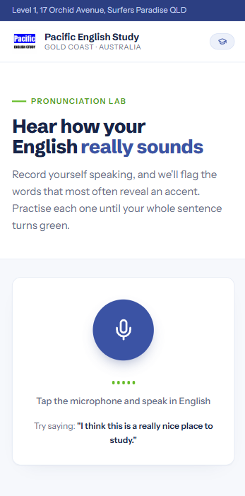

<div align="center">

# SpeakCheck — Pronunciation Lab

**A browser-based pronunciation coach for English learners.**

Speak freely, get the tricky words flagged in real time, and practise each one until your whole sentence turns green — all running 100% on-device, with zero dependencies and zero backend.

<br>

[](https://dottoleao.github.io/SpeakCheck-/)


<br>



</div>

---

## Overview

SpeakCheck listens to you speak English, transcribes it live, and highlights the words that most commonly reveal a foreign accent — *th* sounds, R/L and V/W confusion, silent letters, vowel length, word stress. Each flagged word becomes an interactive card: **hear** the native pronunciation, then **say it back** until the app confirms you nailed it.

The interface is themed after [Pacific English Study](https://pacificenglishschool.com/), a real language school on the Gold Coast, Australia — built as a white-label branding exercise using the school's official colours and identity.

**[→ Open the live demo](https://dottoleao.github.io/SpeakCheck-/)** *(Chrome on Android/desktop or Safari on iOS, microphone required)*

## Key features

- **Free, continuous speech input** — no scripts to read; speak as long as you like and tap the mic to stop
- **Smart flagging** — a curated dictionary of 45+ high-frequency pronunciation traps, language-agnostic
- **Hear / Say loop** — native TTS playback at reduced speed, then per-word re-recording with verification that guards minimal pairs (*three*/*tree*, *ship*/*sheep*) instead of accepting loose partial matches
- **Live transcription** — words render on screen while you're still speaking (interim results)
- **Teacher-style corrections** — flagged words get a red wavy underline (plus a ⚠/✓ marker) that turns green when fixed
- **Light & dark mode** — follows the system colour scheme automatically
- **Accessible** — live status regions for screen readers, descriptive mic/button labels, and non-colour cues for flagged vs. corrected words
- **Clear error feedback** — distinct messages for denied permission, no speech, no microphone, or no connection
- **Fully private** — audio never leaves the device; no server, no tracking, no accounts

## How it works

```
Microphone → SpeechRecognition (interim + final results)
           → text normalisation → dictionary matching
           → correction cards → SpeechSynthesis playback
           → per-word re-recognition → fuzzy match → pass/fail
```

| Layer | Choice | Why |
|---|---|---|
| Speech-to-text | **Web Speech API** (`SpeechRecognition`) | On-device/browser-native STT, no API costs, works offline-ish |
| Text-to-speech | **SpeechSynthesis API** | Native voices, rate control for slow playback |
| UI | **Vanilla HTML/CSS/JS** | Single file, no build step, instant load on any phone |
| Icons | **Lucide** (pinned) | Consistent icon system, re-hydrated after dynamic DOM injection |
| Animation | **Motion** (motion.dev, pinned) | Compositor-accelerated micro-interactions; auto-disabled under `prefers-reduced-motion` |
| Verification | Token + bounded Levenshtein matching | Accepts recognition variance but rejects confusable minimal pairs |

The core insight: when an accent distorts a word enough, the speech engine *mishears it* (e.g. *think* → *sink*). SpeakCheck exploits that as a free pronunciation signal — no acoustic analysis needed.

## Running locally

It's a single `index.html`. Clone and open it — that's it.

```bash
git clone https://github.com/DottoLeao/SpeakCheck-.git
```

> Speech recognition requires Chrome (desktop/Android) or Safari (iOS) and microphone permission.

## Roadmap

- [ ] Per-session score and streak tracking
- [ ] Custom word lists per class level (A1–C1)
- [ ] Sentence-level stress and rhythm feedback

## Author

**Lorenzo Leão Dotto** — Full Stack Developer & Data Scientist

[](https://lorenzodotto.com.br)
[](https://github.com/DottoLeao)
[](https://linkedin.com/in/lorenzo-leão-dotto)

## License

Released under the [MIT License](LICENSE).
